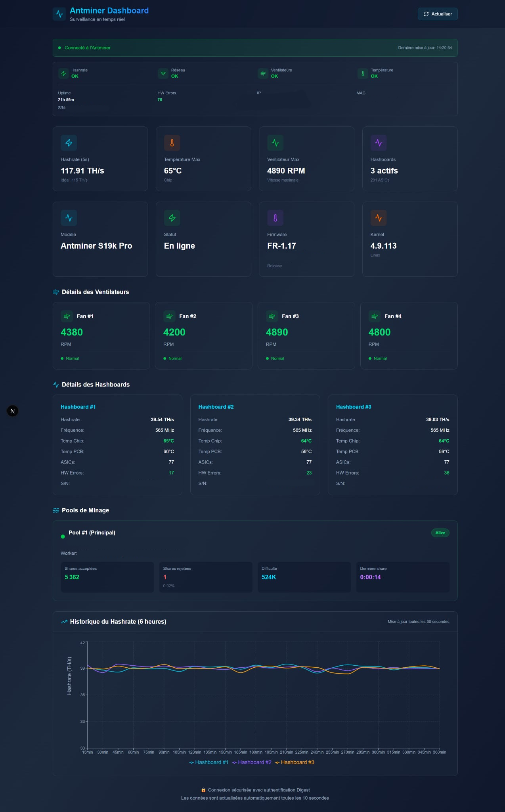

# Antminer Dashboard 🔧⚡

A modern and secure dashboard to monitor your Antminer in real-time.



## ⚠️ Important Network Requirement

**This application must run on the same local network as your Antminer.**

The Next.js server needs direct network access to your Antminer. Deploy options:
- ✅ **Local deployment**: Run on your local machine or Raspberry Pi on the same network
- ✅ **VPN access**: Use Tailscale/WireGuard to connect to your local network remotely
- ❌ **Cloud deployment** (Vercel, etc.): Won't work unless connected via VPN to your local network

## ✨ Features

- 🔒 **Ultra-secure**: Digest authentication for API calls
- ⚡ **Real-time**: Auto-refresh every 10 seconds
- 🎨 **Modern UI**: Beautiful design with Tailwind CSS
- 🚀 **High Performance**: Built with Next.js 15, Bun, and tRPC
- 📊 **Complete Visualization**: Display all Antminer system data
- 📈 **Interactive Charts**: 6-hour hashrate history with Recharts

## 🔧 Tech Stack

- **Next.js 15**: React framework with App Router
- **Bun**: Ultra-fast JavaScript runtime
- **tRPC**: Type-safe API
- **Tailwind CSS**: Utility-first CSS framework
- **TypeScript**: Static typing
- **React Query**: State management and caching
- **Recharts**: Modern charting library

## 🚀 Installation

### 1. Clone the repository

```bash
git clone <your-repo-url>
cd antminer-dashboard
```

### 2. Install dependencies

```bash
bun install
```

### 3. Configure environment variables

Create a `.env` file in the project root:

```env
# Antminer API Configuration
ANTMINER_HOST=http://192.168.1.100
ANTMINER_USERNAME=root
ANTMINER_PASSWORD=your_password_here

# Security - Change this to a random string in production
# Generate with: openssl rand -base64 32
API_SECRET_KEY=change_this_to_a_random_secret_key_in_production
```

⚠️ **IMPORTANT**: Replace the values with your actual Antminer credentials.

### 4. Generate a secure secret key

```bash
openssl rand -base64 32
```

Copy the result into `API_SECRET_KEY` in your `.env` file.

## 🏃 Running the Application

### Development mode

```bash
bun dev
```

The dashboard will be available at [http://localhost:3000](http://localhost:3000)

### Production mode

```bash
# Build
bun run build

# Start
bun start
```

## 🔒 Security

This project implements multiple security layers:

### 1. Digest Authentication
- Uses HTTP Digest authentication (more secure than Basic Auth)
- Password is never sent in clear text
- Protection against replay attacks

### 2. Environment Variables
- All credentials stored in `.env`
- `.env` file is ignored by Git (never committed)
- Use `.env.example` as a template

### 3. Server-side API Security
- Antminer API calls are made **exclusively** server-side
- Credentials never exposed to the client
- tRPC provides type-safe layer

### 4. Best Practices
- **NEVER** commit the `.env` file
- **NEVER** expose your credentials
- Change the `API_SECRET_KEY` in production
- Use HTTPS in production (reverse proxy like Nginx)

## 📁 Project Structure

```
antminer-dashboard/
├── app/                          # Next.js App Router
│   ├── api/
│   │   └── trpc/                # tRPC API endpoints
│   ├── components/              # React components
│   ├── layout.tsx               # Main layout
│   ├── page.tsx                 # Dashboard page
│   └── providers.tsx            # React Query & tRPC providers
├── lib/                         # Utility libraries
│   ├── antminer-client.ts       # Antminer API client
│   ├── digest-auth.ts           # Digest authentication
│   ├── trpc.ts                  # tRPC server configuration
│   └── trpc-client.ts           # tRPC client configuration
├── server/
│   └── routers/                 # tRPC routes
│       ├── _app.ts              # Main router
│       └── antminer.ts          # Antminer endpoints
├── .env                         # Environment variables (create this)
├── .env.example                 # Environment template
└── README.md
```

## 🎨 Customization

### Change refresh interval

In `app/page.tsx`, modify the `refetchInterval` value:

```typescript
const { data: systemInfo } = trpc.antminer.getSystemInfo.useQuery(
  undefined,
  {
    refetchInterval: 10000, // 10 seconds (in milliseconds)
  }
);
```

### Add new endpoints

1. Add a method in `lib/antminer-client.ts`
2. Create a new endpoint in `server/routers/antminer.ts`
3. Use it in your components with `trpc.antminer.yourEndpoint.useQuery()`

## 📊 API Endpoints Implemented

| Endpoint | Data | Refresh | Usage |
|----------|------|---------|-------|
| `system_info.cgi` | System info, network, firmware | 10s | General information |
| `stats.cgi` | Hashrate, temps, fans, hashboards | 10s | Real-time stats |
| `chart.cgi` | 6-hour hashrate history | 30s | Chart |
| `pools.cgi` | Pools, shares, difficulty | 15s | Mining pools |
| `summary.cgi` | Health, uptime, status | 10s | System health |

## 🐛 Troubleshooting

### Error "Missing required environment variables"

→ The `.env` file doesn't exist or is misconfigured

**Solution**: Make sure the file exists and contains all variables

### Error "HTTP error! status: 401"

→ Incorrect credentials

**Solution**: Check the password in `.env`

### Error "ECONNREFUSED" or "Network error"

→ The Antminer is not accessible from the server

**Solution**: 
- **Verify network**: Make sure the Next.js server is on the same network as the Antminer
- Check the IP with `ping <antminer-ip>` from the server
- Check firewall settings on both server and Antminer
- If deployed remotely: Set up VPN (Tailscale) to connect to your local network

## 🌐 Deployment Options

### ⚠️ Network Requirements

**Critical**: The server running this application must be able to reach your Antminer on the local network.

### Recommended Deployment Scenarios

#### 1. Local Network Deployment (Recommended)

Deploy on a device on the same network as your Antminer:

**Raspberry Pi / Mini PC:**
```bash
# On your local server
git clone <your-repo>
cd antminer-dashboard
bun install
bun build
bun start
```

Access via: `http://<local-server-ip>:3000`

#### 2. Remote Access via VPN

If you need remote access:

**Option A: Tailscale (Easiest)**
```bash
# Install Tailscale on both your server and devices
curl -fsSL https://tailscale.com/install.sh | sh
tailscale up
```

**Option B: WireGuard**
Set up WireGuard VPN to connect to your home network.

#### 3. Reverse Proxy (for HTTPS on local network)

### Using Nginx

```nginx
server {
    listen 443 ssl http2;
    server_name antminer.yourdomain.com;

    ssl_certificate /path/to/cert.pem;
    ssl_certificate_key /path/to/key.pem;

    location / {
        proxy_pass http://localhost:3000;
        proxy_http_version 1.1;
        proxy_set_header Upgrade $http_upgrade;
        proxy_set_header Connection 'upgrade';
        proxy_set_header Host $host;
        proxy_cache_bypass $http_upgrade;
    }
}
```

### ❌ Cloud Deployment (Not Recommended)

**Important**: Deploying to Vercel, Netlify, or other cloud providers will **NOT work** unless you:
1. Set up a VPN (Tailscale/WireGuard) to connect the cloud server to your local network
2. Configure the VPN on the deployment platform (complex)

**For most users**: Local deployment or VPN-connected deployment is recommended.

## 📝 License

MIT

## 🙏 Credits

Dashboard created with Next.js, tRPC, Tailwind CSS, and lots of ❤️
